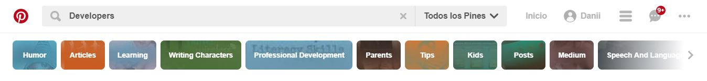

# Partes Ux y UI - Pinterest
___
## UX
* Guarda las búsquedas que antes se hizo.

* Al buscar, también muestra referencias y autocompletados de lo que se busca.

* Guarda las imágenes en diferentes categorías según como los nombre el usuario.

* Link de referencia de la ubicación general de la imagen

## UI
* Diseño de botones.
* Bordeados de los contenedores de las imágenes.
* Colores de marca (Rojo y blanco).
* Diseño de iconos.
* Previsualizacion de la imagen seleccionada.

